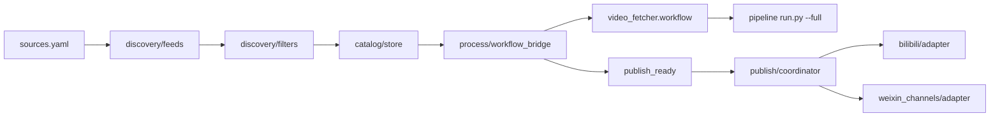

# content_hub 架构

## 数据流



## 任务状态

```
discovered → queued → processing → publish_ready → publishing → published
                     ↘ failed ↗
```

去重键：`youtube:<video_id>`。

## 平台实现状态

| 平台 | 状态 | 说明 |
|------|------|------|
| Bilibili | dry-run + `_upload_real` 占位 | 需 Cookie 或开放 API；设 `CONTENT_HUB_PUBLISH_DRY_RUN=0` 后实现上传 |
| 微信视频号 | dry-run；非 dry-run 抛 `NotImplementedError` | 个人号无稳定 API；企业号接微信开放平台 |

## 配置链

`sources.yaml` 引用：

- `filters.yaml` — 时长、标题关键词、频道黑白名单
- `publish_rules.yaml` — 标题模板、简介页脚、B站 tid
- `platforms.yaml` — 平台开关与环境变量名映射

## 扩展

1. 新平台：在 `publish/<platform>/adapter.py` 实现 `PublisherAdapter`，注册到 `publish/coordinator.py`。
2. 新源：在 `discovery/feeds.py` 增加非 YouTube 展开逻辑。
3. 封面：`prepare/cover.py` 可用 FFmpeg 从 `video.mp4` 截帧。
